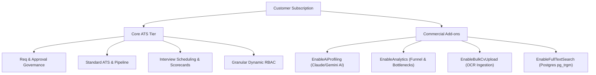

# RecruitOps — Business Requirements Document (BRD)

> **Document Version**: 1.0.0  
> **Target Release**: v1.0 Production Readiness  
> **Architecture Standard**: Single-Tenant Per-Company Deployment ([ADR-0004](file:///c:/Users/Min%20Arkar%20Soe/Desktop/Freelance_Project/RecruitOps/docs/decisions/ADR-0004-single-tenant-deployment.md))  
> **Licensing & Feature Gating**: Add-on & Tier Gating Engine ([ADR-0007](file:///c:/Users/Min%20Arkar%20Soe/Desktop/Freelance_Project/RecruitOps/docs/decisions/ADR-0007-productization-and-addons.md))

---

## 1. Executive Summary & Vision

RecruitOps is an enterprise-grade in-house recruitment & Talent Acquisition SaaS platform designed to bridge the operational gap between **HR Recruiters** and **Department Hiring Managers**. 

Unlike generic ATS tools built exclusively for HR recruiters, RecruitOps treats **Hiring Managers as first-class citizens** by introducing strict approval chains, budget controls, blind interview evaluations, and department-scoped access boundaries.

### Primary Strategic Objectives:
- **Governance & Accountability**: Enforce multi-tier budget and headcount approvals before any job posting is published.
- **Frictionless Collaboration**: Enable hiring managers and panel interviewers to conduct scorecards, debriefs, and @mentions seamlessly without exposing sensitive salary data or cross-department pipelines.
- **Bilingual & Regional Readiness**: Support dual-language operations (Bilingual English + Myanmar Unicode) tailored for mid-market and enterprise businesses in Myanmar and Southeast Asia.
- **Data Privacy & Ownership**: Guarantee physical database isolation per company (Single-Tenant Architecture) alongside PDPA/GDPR candidate right-to-be-forgotten compliance.

---

## 2. Target Market & Customer Profile

| Parameter | Specifications |
|---|---|
| **Target Market Segment** | Mid-Market & Enterprise Companies (50 – 500+ employees) |
| **Primary Industry Focus** | IT/Tech Solutions, Conglomerates, Banking & Finance, Retail & Distribution |
| **Target Persona (Buyer)** | Chief Human Resources Officer (CHRO), HR Director, VP of People Ops, Operations Director |
| **Target Persona (Users)** | Talent Acquisition Specialists, In-house Recruiters, Department Hiring Managers, Executive Approvers (CFO/CEO) |
| **Supported Localization** | Bilingual English + Myanmar Unicode (Zawgyi auto-conversion support for search inputs) |

---

## 3. SaaS Commercial Licensing & Tiering Model

RecruitOps operates on a **Modular Add-on Licensing Model** ([ADR-0007](file:///c:/Users/Min%20Arkar%20Soe/Desktop/Freelance_Project/RecruitOps/docs/decisions/ADR-0007-productization-and-addons.md)). Every customer receives the Core Platform, while advanced features are dynamically gated via Feature Flags.

### Commercial Tier Matrix:

| Module / Feature | Core Base Tier | Professional Add-on | Enterprise Tier |
|---|---|---|---|
| **Requisition Approval Chain** | ✅ Included | ✅ Included | ✅ Included |
| **ATS Candidate Pipeline** | ✅ Included | ✅ Included | ✅ Included |
| **Interview & Scorecards** | ✅ Included | ✅ Included | ✅ Included |
| **Dynamic Role Builder (RBAC)** | ✅ Included | ✅ Included | ✅ Included |
| **AI CV Profiling (`EnableAiProfiling`)** | ❌ Gated (403) | ✅ Included | ✅ Included |
| **Analytics Dashboard (`EnableAnalytics`)** | ❌ Gated (403) | ✅ Included | ✅ Included |
| **Bulk CV Upload (`EnableBulkCvUpload`)** | ❌ Gated (403) | ✅ Included | ✅ Included |
| **Trigram Full-Text Search (`EnableFullTextSearch`)** | Standard Search | ✅ Included | ✅ Included |

---

## 4. Multi-Tenancy & Data Security Governance

> [!IMPORTANT]
> **Single-Tenant Infrastructure Mandate ([ADR-0004](file:///c:/Users/Min%20Arkar%20Soe/Desktop/Freelance_Project/RecruitOps/docs/decisions/ADR-0004-single-tenant-deployment.md))**  
> To satisfy enterprise security requirements and eliminate cross-tenant data leaks, each company client is deployed in a physically isolated application container and PostgreSQL database instance. Subdomain routing (e.g., `company-a.recruitops.com`) enforces tenant identity.

### Security & Compliance Architecture:
1. **Tenant Data Isolation**: Database-level separation preventing any shared schema vulnerabilities.
2. **Department Scoping ([ADR-0003](file:///c:/Users/Min%20Arkar%20Soe/Desktop/Freelance_Project/RecruitOps/docs/decisions/ADR-0003-department-scoping.md))**: Department Hiring Managers are strictly restricted to requisitions, candidates, and scorecards associated with their assigned department.
3. **Data Retention & PDPA/GDPR Compliance**:
   - **Automated Retention**: Candidate profiles and resumes are retained for a maximum of 2 years (configurable per company policy).
   - **Right-to-be-Forgotten**: Candidates can request profile deletion via public application link; recruiters can execute hard deletion purging database records and MinIO/R2 stored documents.
   - **Audit Logs**: Immutable log history for all status transitions, approval decisions, and salary data accesses.

---

## 5. Production Release Readiness & SLA Requirements

| Requirement Area | Production Standard / Metric | Verification Status |
|---|---|---|
| **Service Level Agreement (SLA)** | 99.9% Uptime Guarantee | Enforced via Docker Compose Production Topology ([docker-compose.prod.yml](file:///c:/Users/Min%20Arkar%20Soe/Desktop/Freelance_Project/RecruitOps/docker-compose.prod.yml)) |
| **Database Migration Safety** | Idempotent EF Core startup auto-migration | Verified (`InitialCreate` through `AddCvIngestionAndAiProfileFields`) |
| **Backup & Disaster Recovery** | Daily automated PostgreSQL `pg_dump` backups with 30-day retention | Documented in [deployment-runbook.md](file:///c:/Users/Min%20Arkar%20Soe/Desktop/Freelance_Project/RecruitOps/docs/architecture/deployment-runbook.md) |
| **API Health & Version Metadata** | Public `/health` and `/api/version` endpoints | Built & Tested ([VersionController.cs](file:///c:/Users/Min%20Arkar%20Soe/Desktop/Freelance_Project/RecruitOps/backend/src/Api/Controllers/VersionController.cs)) |
| **Hardware Sizing** | Small (<50 staff), Medium (50-500 staff), Enterprise (>500 staff) | Documented in [server-sizing-guide.md](file:///c:/Users/Min%20Arkar%20Soe/Desktop/Freelance_Project/RecruitOps/docs/architecture/server-sizing-guide.md) |
| **Automated Test Inventory** | 100% Backend & Frontend Test Suite Execution | **510 Backend Tests Passed**, **318 Frontend Tests Passed**, **0 TypeScript Errors** |
