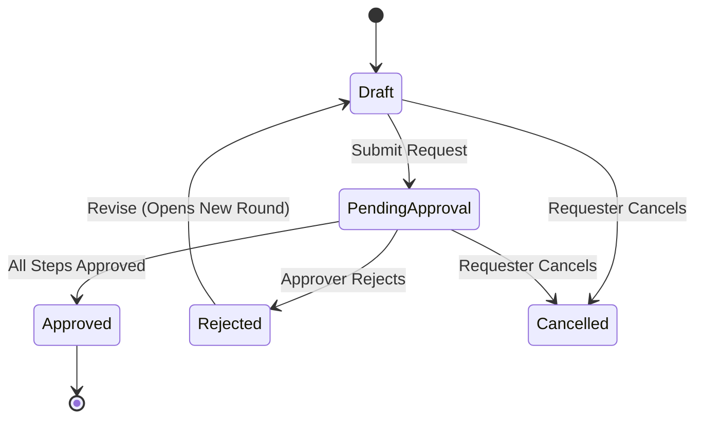

# RecruitOps — Functional Requirements Document (FRD)

> **Document Version**: 1.0.0  
> **System Architecture**: .NET 10 Clean Architecture API + Vite React SPA + Next.js SSR Portal  
> **Database Engine**: PostgreSQL 17 Alpine + `pg_trgm` Extension

---

## 1. Module Functional Specifications

### 1.1 Module 1: Job Requisition & Approval Governance

> **Purpose**: Manage job position requests, sequential approval chains, budget/headcount threshold triggers, and resubmission workflows.

#### Functional Requirements:
- **FR-M1-01 (Requisition Creation)**: Hiring Managers and Recruiters can create job requisitions containing Job Title, Department, Target Start Date, Headcount, Salary Range, Employment Type, and Justification. Initial status is `Draft`.
- **FR-M1-02 (Sequential Approval Chains)**: Submitting a requisition snapshots the active approval chain template for that department. Approvals proceed strictly sequentially by `StepNumber`.
- **FR-M1-03 (Budget & Headcount Threshold Triggers)**: Requisitions exceeding company threshold rules (e.g. Salary Budget > $1,000 or Headcount > 5) automatically inject executive approvers (CFO / HR Director) into the approval sequence.
- **FR-M1-04 (Revise & Resubmit Workflow)**:
  - If a requisition is `Rejected`, the requester can revise details and return the request to `Draft`.
  - Resubmission opens **Round *n+1*** and restarts approval at Step 1.
  - Previous rejection records and approver comments remain immutable in audit history.
- **FR-M1-05 (Cancellation)**: Requester can cancel a requisition in `Draft` or `PendingApproval` state. Chain steps remain frozen in historical record.

---

### 1.2 Module 2: ATS & Sourcing (Candidates, Postings & AI Profiling)

> **Purpose**: Manage job postings, public candidate application forms, candidate pipelines, CV text extraction, and AI profiling.

#### Functional Requirements:
- **FR-M2-01 (Job Postings)**: Recruiter creates job postings derived from `Approved` requisitions. Publishing generates an unguessable public token for external candidate access.
- **FR-M2-02 (Custom Application Forms)**: Supporting dynamic schema questions (Text, Multiple Choice, Checkboxes, File Uploads) with server-side validation.
- **FR-M2-03 (Candidate Pipeline & Stage History)**:
  - Standard pipeline stages: `Applied` → `Screening` → `Interview` → `Offer` → `Hired` (or `Rejected`).
  - Stage transitions write to an append-only `StageHistory` log with timestamp and actor ID.
- **FR-M2-04 (CV Ingestion & Local OCR)**: Bulk PDF and DOCX resume upload extracts raw text in-process with zero network latency.
- **FR-M2-05 (AI Skill Extraction & Executive Summary)**:
  - Key-gated Claude/Gemini AI client profiles candidate skills, work history, and education.
  - Generates executive summary in English and Myanmar Unicode.
  - Stamp simulated headers (`X-Ai-Simulated: true`) when running in local development mode without an API key.
- **FR-M2-06 (Trigram Full-Text Search)**: PostgreSQL `pg_trgm` trigram index enables fast full-text fuzzy search across candidate names, emails, phone numbers, and extracted CV text.

---

### 1.3 Module 3: Interview & Assessment

> **Purpose**: Schedule candidate interviews, enforce panel blind evaluation, record scorecards, and debrief via threaded notes.

#### Functional Requirements:
- **FR-M3-01 (Interview Scheduling)**: Recruiters schedule interview rounds, assign panel members (Recruiters, Hiring Managers, Technical Interviewers), set time/location/meeting link.
- **FR-M3-02 (iCal / Email Invitations)**: System generates SMTP email notifications containing `.ics` calendar invitation attachments for candidate and panel interviewers.
- **FR-M3-03 (Strict Blind Evaluation Governance)**:
  - Panel members record scores (1–5 scale) and recommendation across structured criteria.
  - **Blind Enforcement**: Individual scorecard ratings remain completely hidden from other panel members until all assigned scorecards are submitted or the interview transitions to `Debrief`.
- **FR-M3-04 (Threaded Debrief Notes & @Mentions)**: Interview panel members discuss candidate fit in threaded notes supporting `.mention` styling and notifications for tagged colleagues.

---

### 1.4 Module 5: Reporting & Analytics

> **Purpose**: Track recruitment metrics, time-to-hire, pipeline conversion funnels, and sourcing channel efficiency.

#### Functional Requirements:
- **FR-M5-01 (KPI Metrics)**: Computes active requisitions, total candidates in pipeline, offer acceptance rate, and average time-to-hire.
- **FR-M5-02 (Funnel Bottleneck Analysis)**: Visualizes candidate throughput across pipeline stages, highlighting average days spent in each stage.
- **FR-M5-03 (Time-to-Hire Breakdown)**: Analyzes duration from requisition approval to candidate offer acceptance by department and job level.
- **FR-M5-04 (Feature Gate Protection)**: Gated behind `[FeatureGate("EnableAnalytics")]`; returns HTTP 403 Forbidden when analytics add-on is disabled.

---

### 1.5 Module 7: Dynamic RBAC & User Account Management

> **Purpose**: Provide granular role creation, module/feature permission matrix grids, user account management, and Super-Admin cross-tenant governance.

#### Functional Requirements:
- **FR-M7-01 (Granular Permission Model)**: Canonical permission structure `permission:<module>:<feature>:<action>` containing 34 canonical permissions across Requisitions, ATS, Interviews, Analytics, Users, Roles, and System Settings.
- **FR-M7-02 (Role Builder UI)**: Interactive matrix grid UI (`/roles`) allowing creation and editing of custom roles by selecting fine-grained permission checkboxes.
- **FR-M7-03 (Policy Authorization Handler)**: `[HasPermission("permission:...")]` policy attribute dynamically evaluates user claims against database role assignments.
- **FR-M7-04 (User Management Directory)**: Full CRUD endpoints and UI table (`/users`) for creating, editing, deactivating, and assigning roles to user accounts.
- **FR-M7-05 (Super-Admin Governance)**: Dedicated cross-tenant system owner role capable of managing company instances and system-wide settings using `X-Tenant-Id` headers.
- **FR-M7-06 (Permission-Aware UX)**: Frontend navigation links, action buttons, and route guards automatically fail closed and hide unauthorized UI elements gracefully.

---

## 2. Security & Technical Constraints

1. **Authentication**: JWT Bearer Tokens with Refresh Token support (`/api/auth/login`, `/api/auth/refresh`). Password hashing via BCrypt (`workFactor: 11`).
2. **Brute-Force Rate Limiting**: Exponential login throttling preventing credential stuffing attacks (`/api/auth/login`).
3. **Public Apply Rate Limiting**: IP-based rate limiting on public candidate submission endpoints (`/api/postings/{token}/apply`).
4. **Header Security**: Security headers middleware enforcing `X-Content-Type-Options: nosniff`, `X-Frame-Options: DENY`, `X-XSS-Protection: 1; mode=block`, and strict Content Security Policy.
