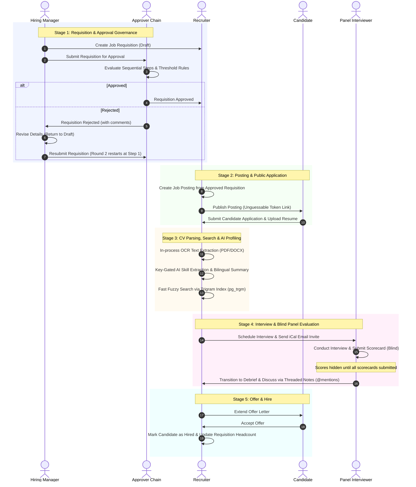
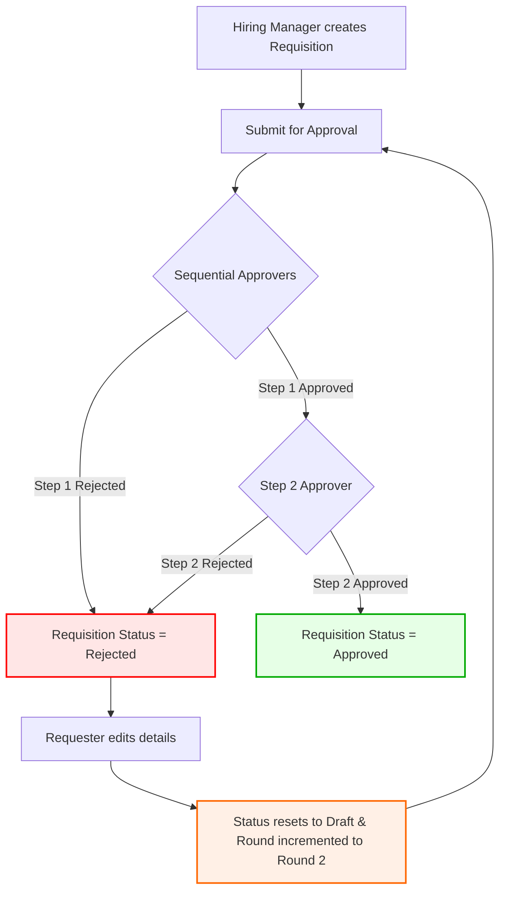
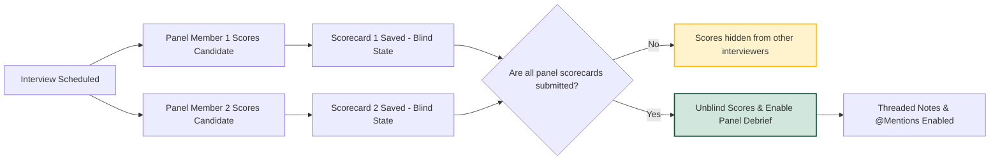
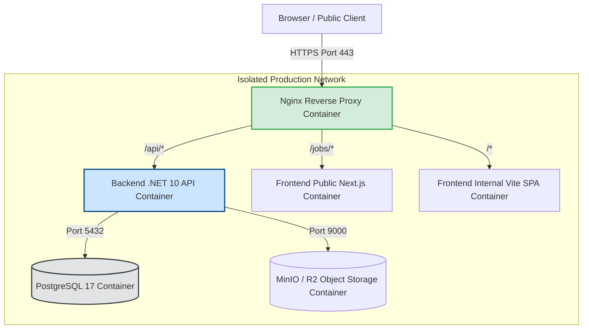

# RecruitOps — End-to-End Workflow Documentation

> **Document Version**: 1.0.0  
> **Scope**: Complete Business & Technical Workflows for RecruitOps v1.0 Production Release

---

## 1. Primary Recruitment Lifecycle Workflow

The primary end-to-end recruitment lifecycle spans 5 distinct stages across 4 user roles (Hiring Manager, Approvers, Recruiter, Candidate, Panel Interviewer):

---

## 2. Requisition Revise & Resubmit Workflow

When a requisition is rejected by any approver in the sequential chain, it follows a strict non-destructive revision workflow ([PROJECT.md](file:///c:/Users/Min%20Arkar%20Soe/Desktop/Freelance_Project/RecruitOps/PROJECT.md)):

---

## 3. Blind Panel Evaluation Workflow

To eliminate interviewer bias during the assessment stage, scorecards enforce strict blind evaluation rules:

---

## 4. Production Container Infrastructure Topology

The production container infrastructure ([docker-compose.prod.yml](file:///c:/Users/Min%20Arkar%20Soe/Desktop/Freelance_Project/RecruitOps/docker-compose.prod.yml)) enforces reverse proxy traffic routing and dropped direct host ports for zero-trust security:

